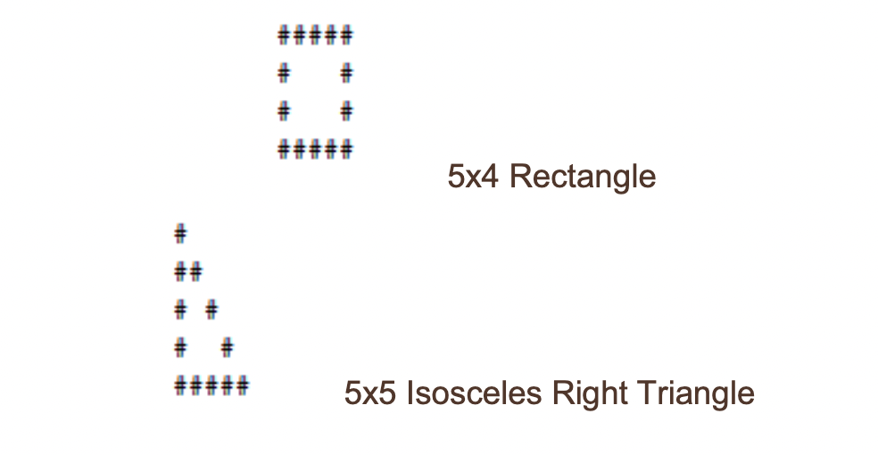

# Return Ready Lab 15

* Part A - Foundations 6.2
* Part B - Foundations 6.3
* Part C - Instructor Challenge

## Part A

### Example and Activity 01

#### Step 01

In the package `lab15.part_a.examples` look at the file `Example01_WhileLoopExample` and write comments for each line of code. When complete review with instructor.

#### Step 02

In the package `labs.lab15.part_a.activity` complete the `Activity01_WhileLoopExample` class so that it accepts an input called stop, and counts from 0 to the value of stop.

Your program is working correctly, if when run, the following is the output.

> Use Example01_WhileLoopExample for reference.

```
Please enter a number to count to: 
8
The Current Number is :0
The Current Number is :1
The Current Number is :2
The Current Number is :3
The Current Number is :4
The Current Number is :5
The Current Number is :6
The Current Number is :7
We are done
```

### Example and Activity 02

#### Step 01

In the package `lab15.part_a.examples` look at the file `Example02_WhileLoopExample2` and write comments for each line of code. When complete review with instructor.

#### Step 02

In the package `labs.lab15.part_a.activity` complete the `Activity02_WhileLoopExample2` class so that it accepts an input called value, performs the arithmetic and saves it to sum, as long as the input number is NOT 0.
If the input is 0, the program should print out the Sum of the integers and exit. 

Your program is working correctly, if when run, the following is the output.

> Use Example02_WhileLoopExample2 for reference.

```
Enter first integer (enter 0 to quit): 2
Enter next integer (enter 0 to quit): 3
Enter next integer (enter 0 to quit): 5
Enter next integer (enter 0 to quit): 0
Sum of the integers: 10
Terminating the program.
```

### Example and Activity 03

#### Step 01

In the package `lab15.part_a.examples` look at the file `Example03_DoWhileLoopExample` and write comments for each line of code. When complete review with instructor.

#### Step 02

In the package `labs.lab15.part_a.activity` complete the `Activity03_DoWhileLoopExample` class so that you print out only the EVEN numbers from 0 to 20.

Your program is working correctly, if when run, the following is the output.

> Use Example03_DoWhileLoopExample for reference.

```
 1 3 5 7 9 11 13 15 17 19
```

## Part B

### Example and Activity 01

#### Step 01

In the package `lab15.part_b.examples` look at the file `Example01_LoopWithBreak` and write comments for each line of code. When complete review with instructor.

#### Step 02

In the package `labs.lab15.part_b.activity` complete the `Activity01_LoopWithBreak` class so that it accepts positive numbers from a user, sums them, and returns them. 
Use a break statement to check if the user enters a negative number, if so, ensure that the program terminates. 

Your program is working correctly, if when run, the following is the output.

> Use Example01_LoopWithBreak for reference.

```
Enter a number: 4.5
Enter a number: 3.5
Enter a number: 2
Enter a number: -3
Sum = 10.0
```

### Example and Activity 02

#### Step 01

In the package `lab15.part_b.examples` look at the file `Example01_LoopWithContinue` and write comments for each line of code. When complete review with instructor.

#### Step 02

In the package `labs.lab15.part_b.activity` complete the `Activity01_LoopWithContinue` class so that you loop through and print 0 through 10.
If the number is between 4 and 9, ensure that the program continues by using the continue keyword. 

Your program is working correctly, if when run, the following is the output.

> Use Example01_LoopWithContinue for reference.

```
1
2
3
4
9
10
```

## Part C

### Activity 01

In the `ValidatePin` class complete the following :

1. Declare a valid integer `securityPin`;
2. Prompt the user to enter a value for `userPin`;
3. In a while loop, perform the following steps:
   1. Compare the user-entered `userPin`  with `securityPin`
   2. If the entered `userPin`is not the same, prompt the user to enter `userPin` again.
4. Print a message confirming that the correct pin has been enetered and that the user now has access to their account.

### Activity 02
In the `DisplayMultiples` class complete the following :

#### Overview

Develop a java program to calculate the multiples of a given number using a for loop.

#### Task
Have the user enter a number, and then use a for loop to display all the multiples of that number from 1 to 50.
Expected Output:

```
Please enter a value:
3
All of these numbers are a multiple of 3:
0 3 6 9 12 15 18 21 24 27 30 33 36 39 42 45 48
```

### Activity 03

#### Overview
Using text to create a picture is known as ASCII art.  In section 2, we made an ASCII art cat.  This required us to type every character in the art we wanted to create.  In this practice, you’ll find a way to draw basic shapes programmatically in customizable sizes.



#### Task

Complete the following two methods in `LoopShape`:

* createRectangle(): This method accepts two arguments for width and height which should be used to print a rectangle 
* createTriangle(): This method accepts one argument for the size of a leg, which should be used to print an isosceles right triangle

Try changing the value of the arguments you’re supplying these two methods from the main method.  Make sure your program can successfully draw each shape to a custom size. Additionally, your program must:

* Refuse to draw shapes with any dimension less than 1
* Be able to draw shapes with any dimension equal to 1 (a 1x1 shape should print just a single character)

If the problem seems difficult, remember to break it into smaller challenges such as:

* How do I print a single line that is a variable number of “#” characters wide? 
* How do I create a String that begins and ends with a “#”, but has a variable number of spaces in between?

Finishing each smaller challenge is an accomplishment.  This problem is as much about understanding loops as it’s about understanding how to break a big problem into smaller tasks.

The knowledge you’ve gained in this section on loops will be very helpful in completing this program.  You’re free to use whichever type of loop statements you feel would be best.  You’ll also need to remember a few concepts from previous sections.


